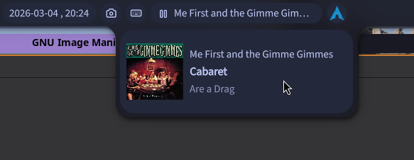

# MPD Plugin for Noctalia

This is a plugin for the [Noctalia](https://noctalia.dev/) shell for controlling [Music Player Daemon](https://www.musicpd.org/)
(MPD). It provides a bar widget displaying the current MPD playback state and
song name, with a hover panel showing full track details and album art. Mouse
buttons can be used to control playback (e.g. play/pause/next/prev) or even
toggle [ashuffle](https://github.com/joshkunz/ashuffle).

## Features

- Shows playback status icon (playing / paused / stopped) and current song name in the bar
- Hover panel with artist, title, album, and embedded cover art (via `mpc readpicture`)
- Configurable left, right, and middle click actions
- Supports [ashuffle](https://github.com/joshkunz/ashuffle)

I wrote the plugin for my own purposes (I want to simply click a button to start
shuffling my entire library and then just do basic controls like next/prev/pause).
Anything more than that (such as selecting specific songs to play) is not
provided, I use a separate client for that (specifically [myMPD](https://github.com/jcorporation/myMPD)).

## Requirements

- Noctalia shell
- MPD running locally
- [`mpc`](https://www.musicpd.org/clients/mpc/) available in `$PATH`
- Optionally: [ashuffle](https://github.com/joshkunz/ashuffle) managed as a systemd user service (`ashuffle.service`)

## Installation

Copy this directory into your Noctalia plugins folder and enable the plugin from
Noctalia's settings.

## Configuration

| Setting | Default | Description |
|---------|---------|-------------|
| Left click | Next track | Action triggered by left-clicking the widget |
| Right click | Play / Pause | Action triggered by right-clicking the widget |
| Middle click | Toggle ashuffle | Action triggered by middle-clicking the widget |
| Stop playback when disabling shuffle | Yes | When toggling ashuffle off, also send `mpc stop` |

Available actions: Next track, Previous track, Play / Pause, Stop, Toggle ashuffle, Do nothing.

## License

MIT — see [LICENSE](LICENSE) for details.
